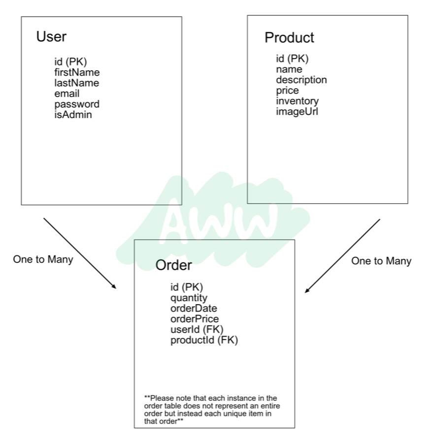
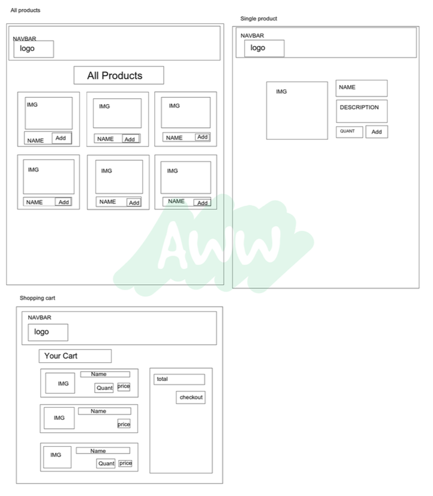

# Welcome to M&J's Spicy Noodle Emporium!

Here at Mork and Jonesy's Spicy Noodle Emporium, we have a huge selection of all your favorite noodles. Browse our site to find the widest selection of noodles on the web. Checkout the details of any of our products, fill your cart, and checkout for speedy noodle delivery. You can even make an account on our site for easier noodle perusing.

## Getting Started

1.  Fork and clone this repo.
2.  `npm install`.
3.  Create `spicy-noodle-emporium` and `spicy-noodle-emporium-test` databases. See schema diagram at the bottom of this file.
4.  Start the build process and your application with: `npm run start-dev`. If you're using Windows, you may need to execute `npm run start-server` and `npm run build-watch` separately (in their own terminal tabs).
5.  Navigate to [localhost:8080](http://localhost:8080) to see the site in the browser.
6.  Check out the mock-view in `wireframes` at the bottom of this file to see the basic layout of the site.
7.  Run the tests with: `npm test`.
8.  Check out the starting seed file in `seed.js` - you can run it by executing `npm run seed`. You will need to seed the database once you've set up the Sequelize models.

### Deployment Link

http://spicynoodleemporium.herokuapp.com/

### Zoom Room

https://fullstackacademy.zoom.us/j/3228421805?pwd=bzhWWXprK1JOWTFDTTcxUW04SFNtdz09

### Norms Doc

https://docs.google.com/document/d/1meAz4HZxk5OklfwdVk5KuWT7N1inTP4_MLp4YGpeFwU/edit?usp=sharing

### Roles Schedule

https://docs.google.com/spreadsheets/d/1CfMRMyNOruxWLwWVoQXgJexgwhQ3WvOZJtIwaruPKag/edit?usp=sharing

### DB Schema

### Wireframes

